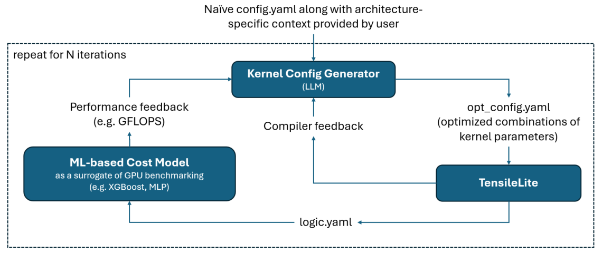

# ML Tuning

A repo to store all code related to machine learning based tuning, which aims to provide a faster tuning process to find best kernel parameters for GEMM.

## Overview of Proposed Tuning Framework

## Experiments and Prototypes

- [QiMeng-GEMM](./qimeng-gemm/README.md)
- [KernelBench](./kernel-bench/README.md)
- [LLM-Guided Kernel Config Generator](./config_generator/README.md)
