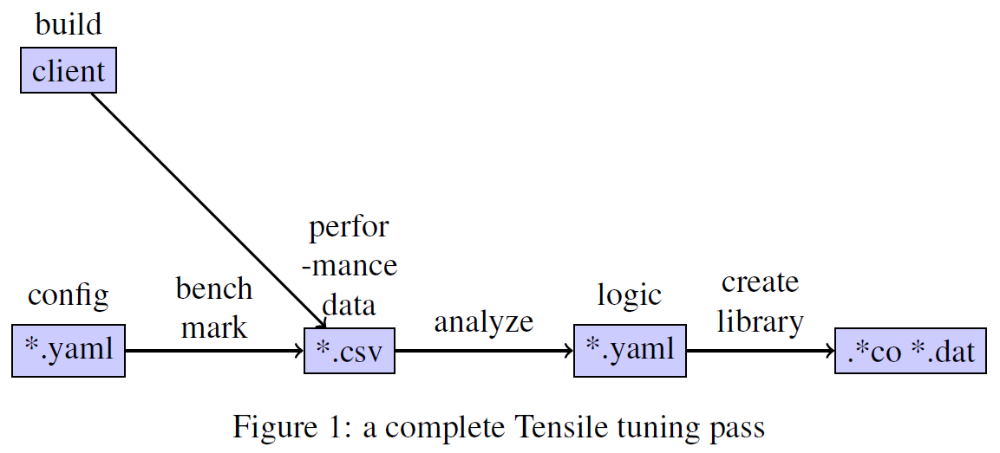

# LLM-Guided Kernel Configuration Generator

This experiment aims to integrate LLM into the Tensile/TensileLite Tuning workflow to generate the optimal GEMM kernels on AMD GPU more efficiently. The key idea is to request the LLM to suggest one or more sets of better kernel parameters based on the benchmark/profiling results of a user-provided kernel configuration and the information of targeting hardware.

## Motivation

In the traditional Tensile/TensileLite tuning process, users need to provide a config yaml following the [Tensile Benchmark Protocol](https://rocm.docs.amd.com/projects/Tensile/en/latest/src/conceptual/benchmarking.html) to construct a search space of the combination of candidate kernel parameters (`ForkParameters`) for all the specified problem sizes.



Tensile implements a quite complicated algorithm to find the optimal kernel configuration from the search space for every specific GEMM size. In order to not to miss the true optimal kernel, we have to specify a quite large number of candidates for variable fork parameters. This makes the tunning workflow very time-consuming.

Tensile v2 provides users the flexibility to manually interrupt the multiplicative series of fork parameters with addtions to dramatically reduce the size of search space. For example:

- `(8 WorkGroups) * (12 ThreadTiles) + (4 NumLoadsCoalesedAs)` is supported by only v2
- `(8 WorkGroups) * (12 ThreadTiles) * (4 NumLoadsCoalesedAs)` is supported by both v1 and v2

However, reducing the redundant forking with this new feature while preserving the optimal solution highly depends on experts' knowledge.

## Objective

Therefore, our goal is to design a framework that incorporates LLM to smartly generate the kernel configurations, so that we can only feed a relatively smaller number of kernel configurations into Tensile, and hence speedup the tuning workflow.

## Proposed Solution

### Input/Output Format

The input of LLM is a comprehensive prompt including the following contents:

- terminology definitions (both hardware parameters and kernel parameters)
- hardware specifications of targeting AMD GPU
- problem description (e.g. matrix size, data type, transpose)
- initial kernel configuration
- benchmark/profiling results of previous kernel configurations (after the initial stage)

The output is a modified kernel configuration that guides Tensile to find the optimal kernel for specific problem sizes on target hardware.

### Iterative Tuning

We proposed an iterative tuning procedure to get an optimal configuration. The pseudocode is shown below:

```
Input:
    model, num_iters, term_def, gpu_spec, problem_desc, config_yaml

Output:
    optimized_config_yaml

Subroutine IterativeTuning:
    kern_config = read_yaml(config_yaml)
    bench_result = call_tensile(kern_config)

    best_config = kernel_config
    best_perf = bench_result

    for i in [1 .. num_iters]:
        prompt = get_prompt(term_def, gpu_spec, problem_desc, kern_config, bench_result)
        advice = get_llm_response(model, prompt)

        kern_config = modify_config(kern_config, advice)
        bench_result = call_tensile(kern_config)

        if bench_result > best_perf:
            best_perf = bench_result
            best_config = kern_config

    return best_config, best_perf
```

### LLM Operations

At each iteration, the LLM proposes edits to the kernel configuration to steer Tensile toward better-performing kernels. It can perform the following types of operations:

- Add a multiplicative fork parameter
- Add an independent fork parameter
- Add a fork parameter candidate

## Environment Setup

Install [Ollama](https://ollama.com/) in the Docker container.

```shell
curl -fsSL https://ollama.com/install.sh | sh
```

Serve Ollama in the background (e.g. `tmux`, `nohup`)

```shell
# with tmux
apt update && apt install -y tmux
tmux new -ds ollama 'ollama serve'

# or with nohup
nohup ollama serve &> /tmp/ollama.log &
```

Download model in another session, take [Llama3.1-8B](https://ollama.com/library/llama3.1) for example.

```shell
ollama pull llama3.1:8b
```

Install dependencies.

```
pip install -r requirements.txt
```

## CLI Usage

Run `main.py` with `--help` option to see the usage:

```shell
python3 main.py --help
```

Get the advice for modifying the kernel config from LLM:

```shell
python3 main.py -i /path/to/config.yaml -o /path/to/advice.md
```
