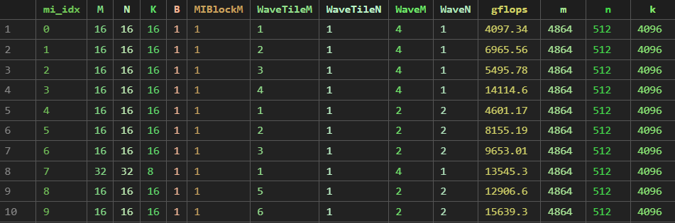
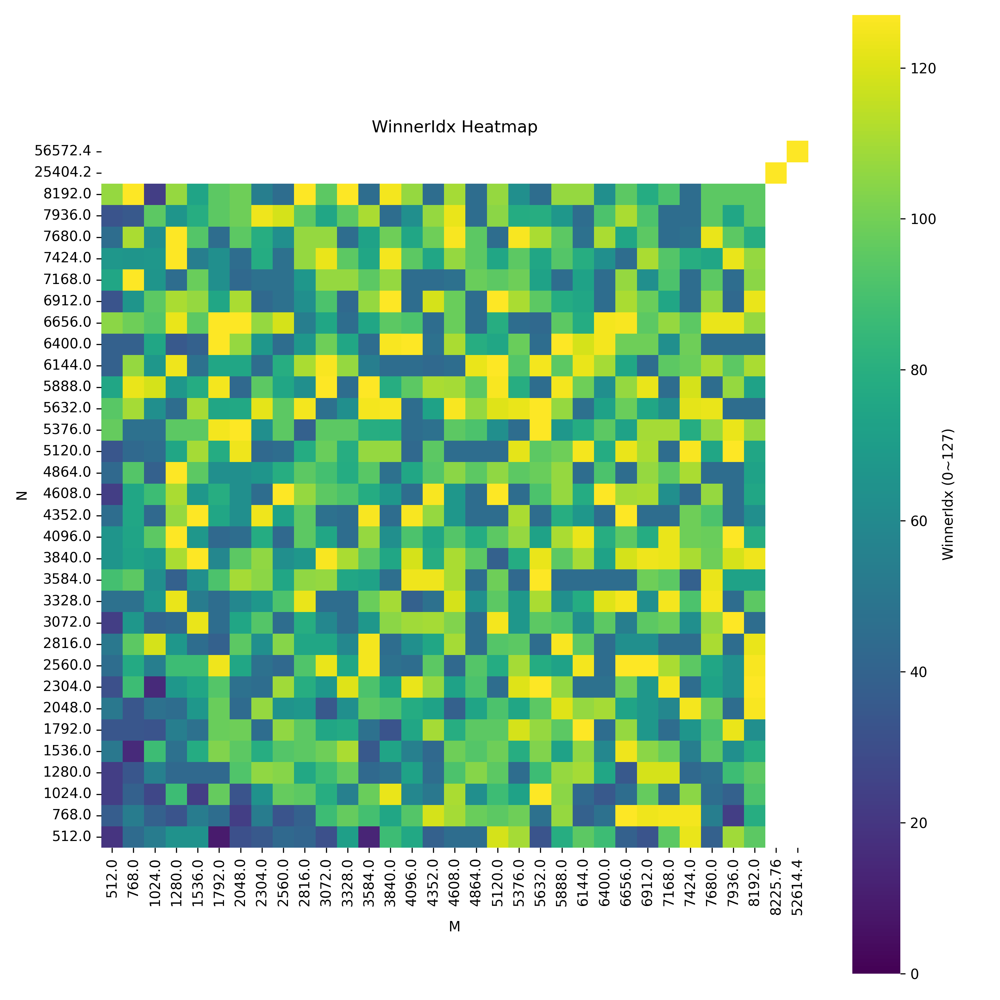

# AI/ML Base Tensile Tuning - Data Collection

This folder contains scripts and tools to collect datasets for machine learning-based tuning. The workflow involves generating problem sizes, creating batched tuning configurations, running Tensile tuning in parallel on different GPU devices, and aggregating the results (GFLOPs).

## Workflow Overview

```text
problem_csv_gen.py
       │
       ▼
problem_sizes.csv
       │
       ▼
1_batch_tuning_yaml_generator.py
       │
       ├───────────────────────────────┐
       ▼                               ▼
tuning_batch_0.yaml             tuning_batch_1.yaml ...
       │                               │
       └──────────────┬────────────────┘
                      ▼
           2_run_all_tensile_yaml.sh
           (Runs Tensile & Exports)
                      │
               ┌──────┴────────────────────────┐
               ▼                               ▼
        tuning on Dev 0                 tuning on Dev n 
               │                               │
               └──────┬────────────────────────┘
                      ▼
            Multiple 00_Final.csv / GFLOPs
                      │
                      ▼
         3_data_gflops_data_collect.py
                      │
                      ▼
            ml_training_dataset.csv
                      │
                      ▼
            datasets for train_mi
```

## Prerequisites

Before running the data collection scripts, you must build Tensile with the `mi_tune` configuration.

```bash
cd hipBLASLt/tensilelite

# Build Tensile with cmake
cmake -DTENSILE_BIN=Tensile -DDEVELOP_MODE=ON -S . -B mi_tune
```
more details of docker usage can be found at confluence.

- python version = 3.10
- other required package is in requirements.txt
```
pip install -r requirements.txt
```

## Step-by-Step Guide

### 0. Generate Problem Sizes
Use the script `problem_csv_gen.py` (or `export_problem_size.py`) to hook out all the problem sizes [M, N, B, K] (e.g., for 104CU).
Or you can gernerate grid base problem size by yourself to a csv file

```bash
python problem_csv_gen.py \
    --logic /workspace/rocm-libraries/projects/hipblaslt/library/src/amd_detail/rocblaslt/src/Tensile/Logic/asm_full/aldebaran/104CU \
    --output problem_sizes_104CU.csv

# or

python3 problem_csv_gen.py \
  --M_start 512 --M_end 8192 --M_step 32 \
  --N_start 512 --N_end 8192 --N_step 32 \
  --K_list "512,4096,16384" \
  --B 1 --out_dir "./generated_problem_sizes"
```

### 1. Generate Batch YAMLs
After the problem size is collected in `problem_sizes_104CU.csv`, use `1_batch_tuning_yaml_generator.py` to create split YAML files. This script uses a baseline YAML template and injects the problem sizes, separating them for different GPU devices.

```bash
python 1_batch_tuning_yaml_generator.py \
    --csv ./problem_sizes_104CU.csv \
    --template ../../tuning_yaml/gemm_fp16_only_mi.yaml \
    --batch-size 200 \
    --out-dir tuning_batches_104CU \
    --num-devices 4 \
    --skip-device 0 \
    --limit 5000
```

### 2. Run Tensile Tuning
Use `2_run_all_tensile_yaml.sh` to run the tuning jobs in parallel across the specified GPUs.

```bash
chmod +x 2_run_all_tensile_yaml.sh

# Usage: ./script.sh <YAML_DIR> <BUILD_DIR> <OUTPUT_DIR> <GPU_LIST>
./2_run_all_tensile_yaml.sh \
    /workspace/ml_tuning/ml_predictor/data_collection/tuning_batches_104CU \
    /workspace/rocm-libraries/projects/hipblaslt/tensilelite/mi_tune \
    /workspace/ml_tuning/ml_predictor/data_collection/tuning_results_104CU \
    "1 2 3"
```

### 3. Collect Data
Compare all the `00_Final.csv` and `00_Final.yaml` outputs to aggregate the Problem Size, Matrix Instruction (MI), and GFLOPs into a single dataset.

```bash
python 3_data_gflops_data_collect.py --root_dir ./tuning_results_104CU --output collected_data.csv
```



---

## Analysis Tools

### Heatmap Visualization
Use `heatmap.py` to visualize the distribution of winner solutions or performance.


```bash
python heatmap.py --tuning_result_folder ./tuning_results_104CU --output solution_heatmap.png
```

### YAML Parameter Analyzer (`analyze_params.py`)
This script analyzes kernel parameter configurations stored in a YAML file generated by **Tensile** after building with your custom tuning configuration.

It helps you:
1. Detect **parameters with inconsistent values** across kernels (outliers).
2. Collect **parameters with fixed values** across all kernels.

**Usage:**
1. Locate the kernel parameter file after building Tensile: `.../Data/00_Final.yaml`
2. Run the analyzer:
   ```bash
   python analyze_params.py
   ```

**Output:**
- `param_outlier_summary.csv`: Parameters that vary, with majority values and outliers.
- `param_fixed_summary.csv`: Parameters that are constant across all kernels.

## References

- **Valid Parameters:** You can check available parameters and how to adjust them in:
  `/workspace/rocm-libraries/projects/hipblaslt/tensilelite/Tensile/Common/ValidParameters.py`