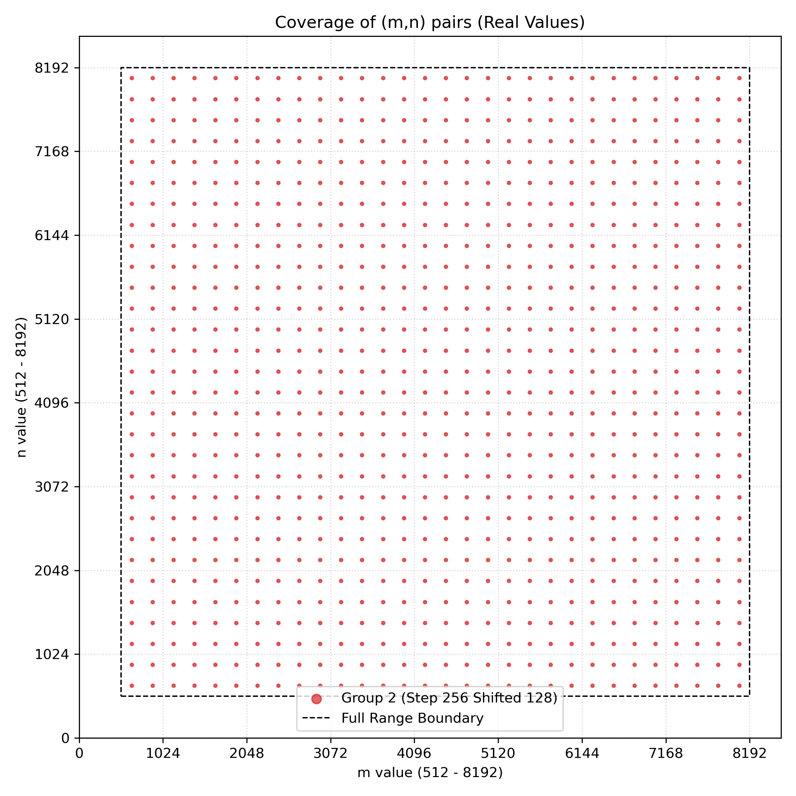
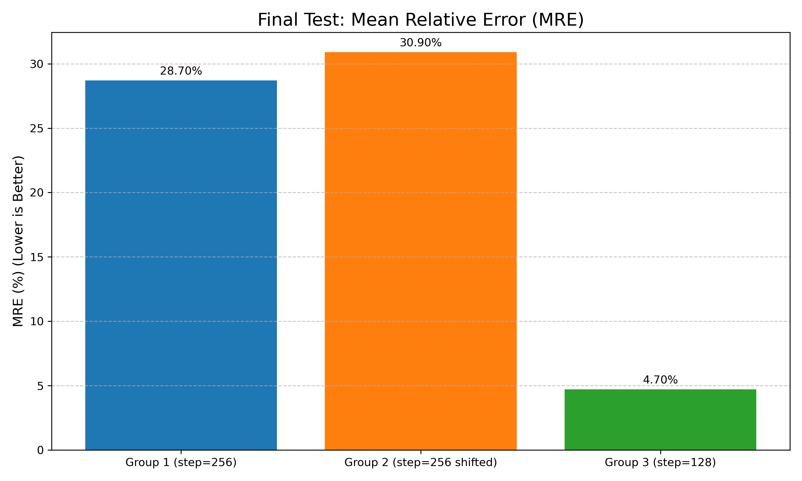
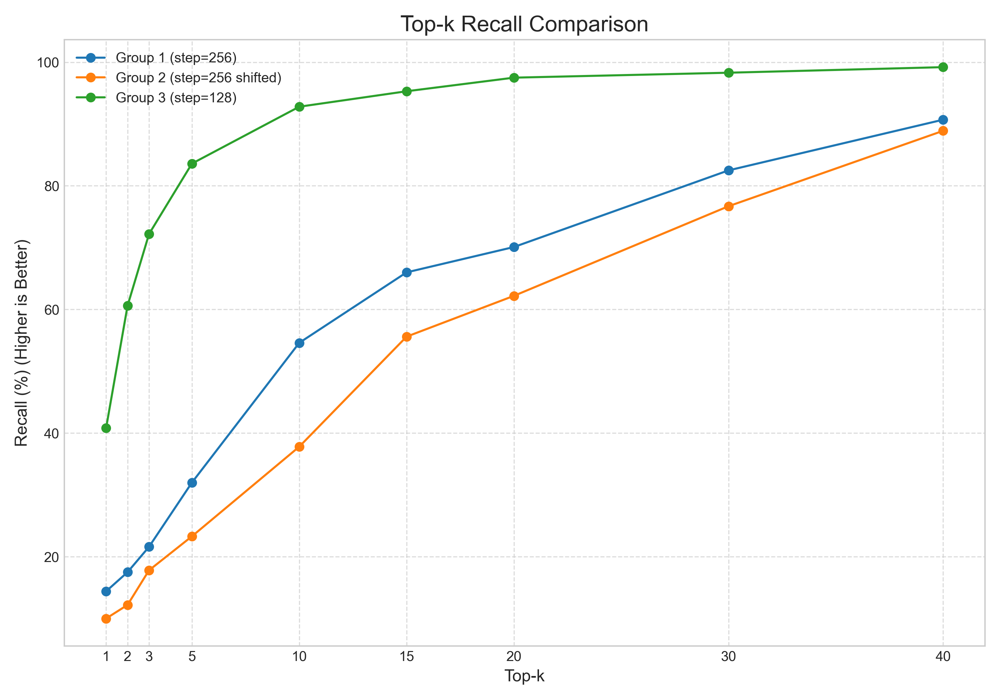
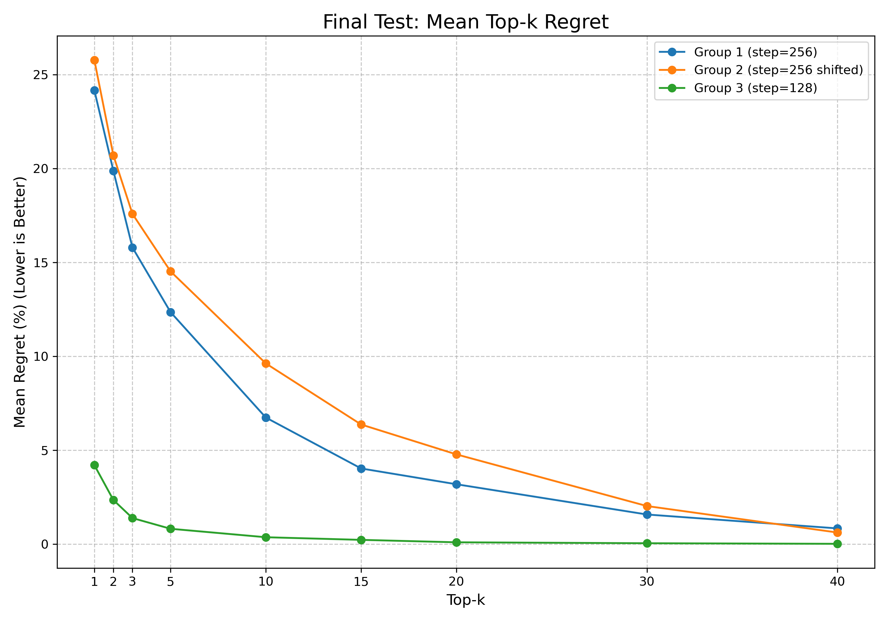
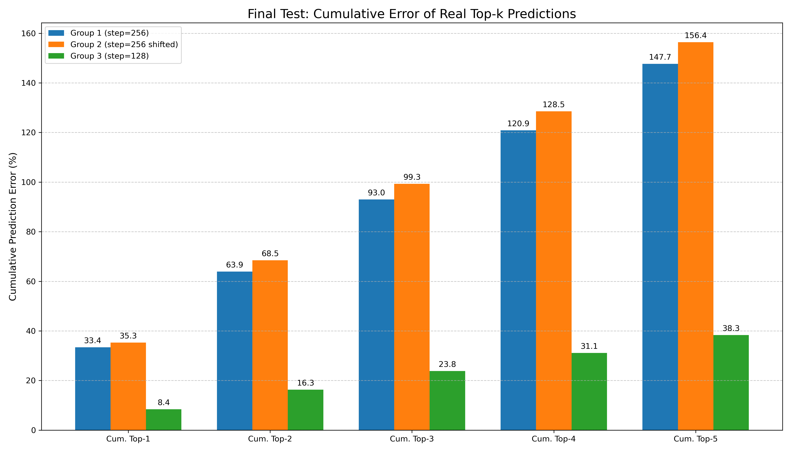
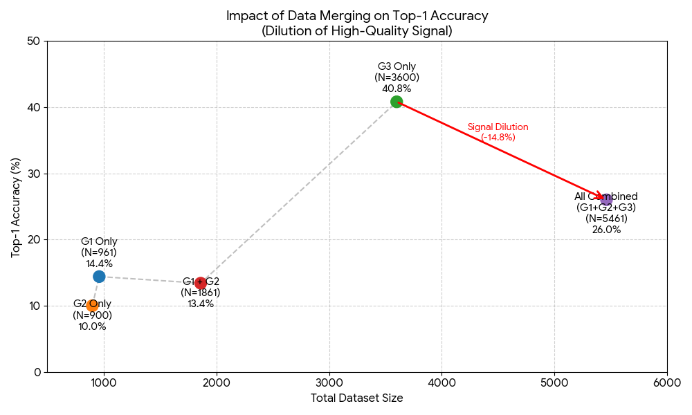
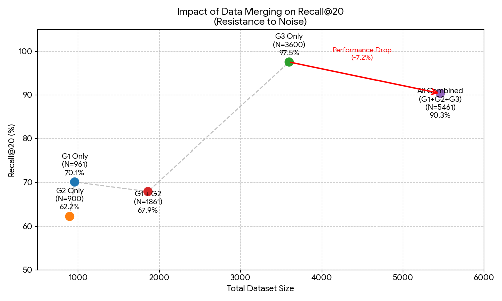
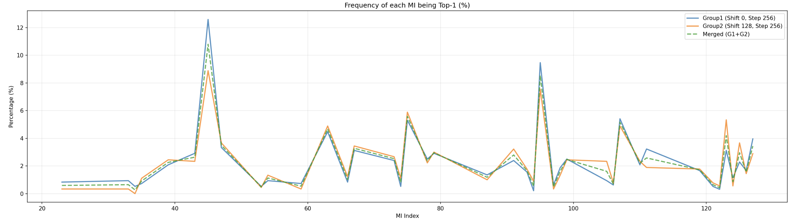
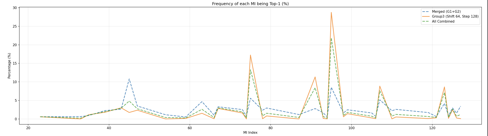
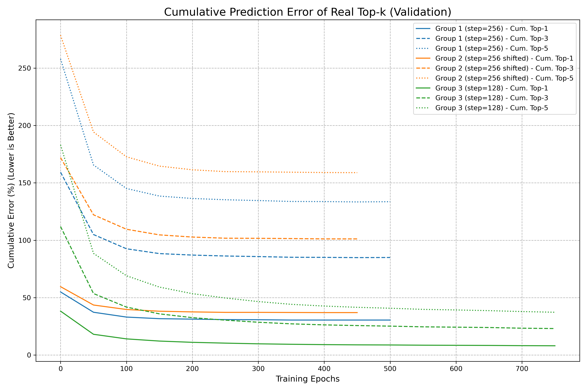

# MI(Matrix Instruction) TensileLite Kernel Performance Prediction using Machine Learning

This project develops a machine learning-based approach to automatically tune the performance of MI (Matrix Instruction) kernels on AMD GPUs, predicting the optimal configuration for GEMM operations based on matrix dimensions (m, n, k=4096) to reduce manual search time.
## 1. Overview

This project provides a comprehensive pipeline for training and evaluating machine learning models that predict the performance of different MI (Matrix Instruction) kernel configurations for GEMM (General Matrix Multiply) operations. The primary goal is to automate kernel tuning by accurately forecasting GFLOPS for a given matrix size and configuration, thereby reducing the need for exhaustive manual benchmarking.

The model uses **XGBoost Regressor** as the core engine, combined with custom evaluation metrics focused on ranking accuracy and regret. The framework supports feature engineering, hyperparameter tuning, and detailed performance analysis across different data regimes.

### Executive Summary: Key Experimental Conclusions
Based on extensive experimentation across different grid densities and dataset combinations, we have established four critical conclusions:

1.  **Grid Density is the Decisive Factor**:
    * **Fine-grained grids (Step=128)** are the threshold for accurate modeling. They reveal consistent, high-concentration performance patterns that allow the model to achieve **97.5% Recall@20**.
    * **Coarse grids (Step=256)** suffer from high entropy and aliasing, failing to capture the underlying hardware logic even with more data.
    - more details in [Baseline Analysis](#61baseline-performance-analysis-in-distribution)

2.  **Quality Trumps Quantity (Negative Interference)**:
    * Contrary to the common belief that "more data is better," we found that merging coarse data with fine data **degrades** performance. The noise from coarse grids dilutes the precise signals from fine grids, reducing Top-1 Accuracy from 40.8% to 26.0%.
    - more details in [Interference Analysis](#63-data-interference--aggregation-analysis)

3.  **Achieving 6.4x Acceleration**:
    * By pruning the search space to the **Top-20** candidates, we achieve a **~6.4x speedup** in tuning time. Real-world benchmarking confirms the inference overhead is negligible (**~0.37s** per problem).
    - more details in [Performence Impact Acceleration](#10-performance-impact--acceleration)
4.  **Deep Learning Potential and Future Directions**:
    * The high quality of fine-grid data allows for deeper training (1500 boosting rounds) without overfitting, unlocking an additional **+5% accuracy** gain.
    - more details in [Ablation Study](#7-ablation-study) and [Future Directions](#9-future-work)
## 2. Dataset Introduction
All datasets contain benchmark results for GEMM operations with **k fixed at 4096** and **m, n ranging from 512 to 8192** (inclusive).  
For each (m, n) problem, **all 128 MI configurations** are evaluated, and the **GFLOPS** is measured after **Tensile tuning**.

- Three different grid m,n problem dataset
    - Group1 
        -  
    - Group2
        - 
    - Group3
        - 
The datasets differ only in **grid step size** and **shift**:

| Group       | File name                        | Step size | Shift | First m/n value | Points per dimension | Total problems | Notes                          |
|-------------|----------------------------------|-----------|-------|-----------------|----------------------|----------------|--------------------------------|
| Group 1     | G1_step256_shift0.csv       | 256       | 0     | 512             | 31                   | 961            | Coarse, starts at 512          |
| Group 2     | G2_step256_shift128.csv       | 256       | 128   | 640             | 30                   | 900            | Coarse, shifted by 128         |
| Group 3     | G3_step128_shift64.csv               | 128       | 64    | 576             | 60                   | 3600           | Fine-grained, ~4× denser       |

Each CSV row contains:
- `mi_idx`: Index of the MI configuration (0–127)
- MI parameters: `M`, `N`, `K`, `B`, `MIBlockM`, `WaveTileM`, `WaveTileN`, `WaveM`, `WaveN`
- Measured kernel `gflops` on MI210 GPU
- Actual matrix dimensions `m`, `n`, `k` (k always 4096)

Key observation:  
**Group 3 (fine grid)** produces the strongest and most stable performance patterns (highly concentrated top-1 configurations).  
**Group 1 & Group 2 (coarse grids)** show more dispersed optimal configurations and weaker patterns due to larger step sizes.

## 3. Model Choice

We adopted **XGBoost Regressor** as our baseline model, following the established methodology of the **TVM Cost Model** (AutoTVM). XGBoost has been widely validated in compiler auto-tuning tasks for its efficiency in capturing non-linear performance characteristics on hardware execution data.

**Key hyperparameters:**
- `objective`: `reg:squarederror`
- `learning_rate`: 0.05
- `max_depth`: 16
- `n_estimators`: 500–1000
- `early_stopping_rounds`: 50

Future extensions can easily incorporate LightGBM or ranking objectives (e.g., LambdaRank).

## 4. Evaluation Metrics

We evaluate model performance per problem (m×n×k) using the following metrics:

- **Regret@1**: Percentage gap between predicted best configuration's GFLOPS and the true best (lower is better)
- **Top-1 Accuracy**: Percentage of cases where the predicted configuration is exactly the true best
- **Top-k Recall (R@k)**: Whether the true best falls within the top-k predicted configurations
- **Mean Rank of True Best**: Average ranking of the true best configuration in the model's predictions amlong the test data
- **True best k MI_idx prdiction error(T@k)** : The Error of GFLOPs of the predicted and the ground truth K MI_idx.
- **RMSE / MAE**: Absolute errors in predicted vs. true GFLOPS values

All metrics are averaged across problems for fair comparison.

## 5. Experiment Classification(Method)

### 5.1. Baseline Performance (In-Distribution)

Objective: Establish a reference point for how well the model performs when the training and testing data come from the same grid density and shift.

- Experiments: Same-dataset training/testing on G1, G2, and G3.

Key Question: How does grid density (Step 128 vs 256) affect the upper bound of model accuracy

### 5.2. Generalization & Zero-Shot Capabilities (Out-of-Distribution)

Objective: Test if the model can predict performance on "unseen" problem sizes (different grid points or shifts).

1. Cross-Shift Persistence: Train G1 → Test G2. (Does a model trained on Power-of-Two points work on shifted points?)

2. Cross-Step Interpolation: Train G3 → Test G1/G2. (Does a fine grid "cover" the knowledge of coarse grids?)

3. Mixed Data Training

### 5.3. Data Interference & Aggregation Analysis

Objective: Challenge the "more data is better" assumption and identify if coarse data acts as "noise."

Negative Interference: G1 + G2 vs G1 only. (Why does adding G2 data degrade G1 performance?) 

Signal Dilution: G1 + G3 vs G3 only. (Does coarse data interfere with the stable patterns found in G3?)

## 6. Results

### 6.1.Baseline Performance Analysis (In-Distribution)
This analysis establishes the reference performance of the XGBoost model when trained and tested on the same grid density and shift configurations. This "In-Distribution" test reveals the upper-bound predictive capability of the model under consistent environmental conditions.

**Objective**
The primary goal of this section is to establish the "upper bound" of model performance when training and testing are conducted on the same data distribution. We evaluate how **Grid Density (Step Size)** and **Alignment (Shift)** inherently affect the model's ability to learn ranking logic.

**Experiment Setup**
We trained three separate XGBoost models on Group 1, Group 2, and Group 3 respectively, using an 80/10/10 split for Training, Validation, and Testing.

#### 6.1.1. Quantitative ResultsPerformance Metrics Comparison Table
Test on Xgboost model with 800 boostround
| Metric | **Group 1** (Step 256, Shift 0) | **Group 2** (Step 256, Shift 128) | **Group 3** (Step 128, Shift 64) |
| :--- | :---: | :---: | :---: |
| **Top-1 Accuracy** | 14.4% | 10.0% | **40.8%** |
| **Mean Top-1 Regret** | 24.16% | 25.77% | **4.21%** |
| **Recall@20** | 70.1% | 62.2% | **97.5%** |
| **Mean Rank of True Best** | 15.5 | 19.3 | **3.9** |
| **MRE (Mean Relative Error)** | 28.7% | 30.9% | **4.7%** |
| **Best Validation RMSE** | 10411.44 | 13254.64 | **4008.42** |

> **Key Observation**: Group 3 (Fine Grid) significantly outperforms the Coarse Grids across all metrics.

#### 6.1.2. Prediction Accuracy & Error
First, we analyze the absolute prediction error. As shown in **Figure 1**, Group 3 achieves a significantly lower Mean Relative Error (MRE).

*Figure 1: Mean Relative Error (MRE) on Test Set. Group 3 achieves 4.7% error, a ~6x reduction compared to Group 1 and 2.*

* **The Density Advantage**: The transition from Step 256 to Step 128 transforms the problem from "rough estimation" (30% error) to "precise interpolation" (4.7% error).
* **Alignment Impact**: Group 1 (Power-of-Two aligned) slightly outperforms Group 2 (Shifted) despite having the same grid density. This suggests that hardware behaviors at aligned boundaries (e.g., 512, 1024) are inherently more stable and easier to model.

---

#### 6.1.3. Ranking Capability & Auto-Tuning Acceleration
For practical auto-tuning, the absolute GFLOPS value is less important than the **ranking order**. We focus on **Recall@k** (probability of finding the true best kernel in the top-k) to validate our pruning strategy.

*Figure 2: Top-k Recall Comparison. Group 3 (Green) reaches 97.5% Recall at k=20.*

*Figure 3: Mean Top-k Regret. Lower is better. Group 3 shows near-zero regret quickly.*

**Key Findings:**
1.  **Enabling 6.4x Speedup**: Group 3 achieves **97.5% Recall@20**. This confirms that we can safely prune the search space from 128 configurations down to the top-20 predictions with negligible risk of missing the optimal kernel.
2.  **Unsafe Pruning in Coarse Grids**: Group 1 and Group 2 only reach ~60-70% recall at k=20. Pruning based on coarse-grid models would result in significant performance loss (high regret).
3.  **Minimal Regret**: Figure 3 shows that for Group 3, even if the predicted top-1 is not the absolute best, the performance gap (Regret) is minimal (<5%).

---

#### 6.1.4. Learning Dynamics & Stability
Finally, we examine the training process to ensure the performance is due to robust learning rather than memorization.

*Figure 4: Training & Validation RMSE Convergence.*

*Figure 5: Cumulative Prediction Error of Real Top-k Kernels on Test Set.*

* **Deep Convergence**: Figure 4 shows Group 3 (Green) converging to a much lower RMSE (~4000) compared to G1/G2 (>10000), which plateau early due to high bias.
* **Elite Pool Reliability**: Figure 5 demonstrates that Group 3 predicts the GFLOPS of the *entire* top-5 elite pool with high precision. The cumulative error for the Top-5 predictions in Group 3 is significantly lower than the Top-1 error of Group 1.

### 6.2. Generalization & Robustness (Out-of-Distribution)

**Objective**
In real-world scenarios, the auto-tuner may encounter matrix dimensions that were not explicitly part of the training set. This section evaluates the model's **zero-shot generalization** capability by testing how well knowledge transfers across different grid densities and hardware alignments.

#### 6.2.1. Cross-Shift Generalization (The Alignment Challenge)
We tested whether a model trained on **Shift 0** (Group 1, Aligned) could predict performance on the difficult **Shift 128** dataset (Group 2, Non-aligned).

* **Source**: Train on G1 (Step 256, Shift 0).
* **Target**: Test on G2 (Step 256, Shift 128).

| Training Source | Test Target | Recall@20 | Regret | Top-1 Acc| Conclusion | 
| :--- | :--- | :---: | :---: | :---: | :--- |
| **G1** (Shift 0) | **G2** (Shift 128) | **64.9%** | 28.77% |6.9%| **Poor Transfer** |
| **G3** (Shift 64) | **G2** (Shift 128) | **77.2%** | 29.71% |7.8%| **Strong Interpolation** |

**Key Findings:**
1.  **Ranking Robustness**: The model trained on **Group 3** achieves a significantly higher Recall@20 (+12.3%) compared to Group 1. This indicates that the fine-grid model captures the broader "ranking logic" better, allowing it to include the optimal kernel in the top-20 candidates more often, even for unseen shifts.
2.  **The Limits of Generalization**: However, the absolute performance remains limited. The **Top-1 Accuracy for both models is low (<8%)**, and the Mean Regret remains high (~29%). This confirms that the **Shift 128** domain contains complex, non-linear hardware behaviors (likely due to cache conflicts at non-aligned boundaries) that are difficult to pinpoint precisely without direct training data.
3.  **Trade-off**: While G3 does not perfectly solve the zero-shot accuracy problem, its higher Recall makes it a **safer choice for pruning** than G1, as it is less likely to discard the true best kernel entirely.

#### 6.2.2. Cross-Step Generalization (Fine-to-Coarse Transfer)
We evaluated whether the fine-grained model (G3) could serve as a "universal" predictor for coarse grids (G1 + G2).

* **Source**: Train on G3 (Step 128).
* **Target**: Test on G1 + G2 (Step 256).

| Training Source | Test Target | Top-1 Acc | Recall@20 | MRE |
| :--- | :--- | :---: | :---: | :---: |
| **G3** | **G1 + G2** | **7.6%** | **76.5%** | **86.9%** |

**Observation:**
While G3 provides decent ranking capability (Recall@20 = 76.5%), the extremely high Mean Relative Error (MRE = 86.9%) suggests that while the model knows "which kernel is best," it struggles to predict the exact *magnitude* of GFLOPS for unseen coarse points. This highlights that **ranking logic transfers well, but absolute performance values require density-specific calibration.**

---

### 6.3. Data Interference & Aggregation Analysis

**Objective**
A common assumption in machine learning is "more data = better performance." We challenge this by analyzing whether merging coarse and fine datasets improves or degrades accuracy.

**1. Impact on Top-1 Accuracy (Precision)**

* **The Peak (G3 Only)**: The model trained solely on Group 3 achieves a **40.8% Top-1 Accuracy**, demonstrating that high-density data contains the clearest signal.
* **The Drop (All Combined)**: When we merge all datasets ($G1+G2+G3$), increasing the data size to 5461 samples, the accuracy **plummets to 26.0%**. This massive **-14.8% drop** confirms that the noisy signals from G1 and G2 actively confuse the model, diluting the precise patterns learned from G3.

**2. Impact on Recall@20 (Ranking Robustness)**

* **Ranking Degradation**: Even for Recall@20, which is generally more robust, we observe a significant decline from **97.5% (G3 Only)** to **90.3% (All Combined)**.
* **Interference Confirmed**: This proves that merging datasets does not "average out" the noise; instead, the conflicting hardware patterns from the coarse grids (G1/G2) degrade the model's ability to consistently rank the true best kernel in the top tier.

#### 6.3.1. Impact of Merging Datasets
We compared models trained on single sources versus merged sources to identify signal interference. We tested two scenarios: adding G1 to G3 (testing on G2), and adding G2 to G3 (testing on G1).

| Training Set | Test Target | Top-1 Accuracy | Recall@20 | Regret | Status |
| :--- | :--- | :---: | :---: | :---: | :--- |
| **G3 random(80%)** | **G3(random 10%)** | 40.8%% | **97.5%** | **4.2%** | Best Baseline |
| **G3 Only** | **G2** | 7.8% | **77.2%** | **29.71%** | Best mixed Baseline |
| **G1 + G3** | **G2** | 8.0% | 76.3% | 31.65% | **Degraded** |
| **G2 + G3** | **G1** | 6.7% | **78.1%** | 30.25% | **Mixed Noise** |

**Analysis: Signal Dilution**
* **Negative Interference**: Adding **Group 1** (coarse) data to the **Group 3** training set actually **reduced** the Recall@20 on the target G2 set (from 77.2% down to 76.3%), despite increasing the data volume.
* **Mixed Noise**: Similarly, adding G2 to G3 when testing on G1 slightly improved Recall@20 but **degraded** Top-1 Accuracy and increased Regret.
* **Conclusion**: The high-quality, concentrated signal from G3 is "diluted" by the noisy, high-entropy signal from the coarse grids. This proves that **data quality (density) trumps data quantity**.

#### 6.3.2. The Failure of Coarse Merging (G1+G2)
Merging two coarse datasets (G1 + G2) also failed to produce a robust model.

* **Experiment**: Train G1+G2 $\to$ Test G1+G2 (Internal Split).
* **Result**: Top-1 Accuracy of **13.4%**.
* **Comparison**: This is lower than the G1-only baseline (14.4%) and barely higher than G2-only (10.0%).

**Insight:**
Merging G1 (Po2 aligned) and G2 (Shifted) creates a dataset with **conflicting hardware patterns**, forcing the model to learn an "average" that fits neither distribution well.

### 6.4. MI Data Distribution Analysis

By systematically analyzing the distribution of "Top-1 MI Configurations" (the winning kernels) across different datasets, we can identify the fundamental reasons behind the performance disparities observed in our experiments.

#### 6.4.1. Signal Concentration vs. Entropy
The "learnability" of a dataset is heavily influenced by the consistency of its labels. We analyzed how many distinct MI configurations appeared as the optimal choice ("Unique Winners") and the frequency of the most dominant configuration.

| Dataset | Unique Winners | Top Winner | Top Winner Freq. | Signal Quality |
| :--- | :---: | :---: | :---: | :--- |
| **Group 3 (Fine)** | **43** | **#95** | **28.7%** | **High Concentration** |
| **Group 1 (Coarse)** | 63 | #45 | 12.6% | High Entropy (Noisy) |
| **Group 2 (Shifted)**| 69 | #45 | 8.9% | High Entropy (Noisy) |

*Figure 4.1: Distribution of Top-1 MI Indices. Group 3 (Orange) shows distinct, high-magnitude peaks, indicating a strong signal. Coarse groups show a flatter, more dispersed distribution (High Entropy).*

**Interpretations:**
* **Strong Signal Stability (Group 3)**: As visualized in the histogram (Top-Left of Figure 4.1), Group 3 reveals a highly stable hardware preference. [cite_start]MI configuration **#95** wins in nearly **30%** of all test cases[cite: 168]. This high concentration creates a "strong signal," allowing the XGBoost model to quickly identify these "star configurations."
* **The Entropy Trap (Group 1 & 2)**: In contrast, the coarse-grid datasets show a much flatter distribution. [cite_start]The optimal kernel changes rapidly between the sparse grid points, resulting in over 60 different unique winners[cite: 189, 211]. This creates a "noisy" label space with high entropy, forcing the model to memorize individual points rather than learning a coherent physical rule.

#### 6.4.2. Structural Patterns & Horizontal Banding
The scatter plots of "Matrix Size vs. Optimal MI" provide visual proof of the data quality difference.

* **Horizontal Banding (Group 3)**: In Group 3, we observe clear **horizontal lines**, indicating that specific MI configurations (like #95) remain optimal across a huge range of matrix dimensions ($m \times n$).
* **Fragmentation (Group 1 & 2)**: The coarse grids show scattered, fragmented points. The "winning" MI jumps unpredictably, likely because the coarse step size (256) causes the grid points to land inconsistently relative to hardware boundaries.

#### 6.4.3. The Coarse Conflict: Why G1+G2 Failed
We specifically analyzed why merging two coarse datasets (G1 + G2) failed to improve performance, despite doubling the data volume.

*Figure 4.2: Frequency of Top-1 MI in Coarse Datasets. Note the misalignment of peaks between G1 (Blue) and G2 (Orange).*

**Analysis of Conflict:**
* **Dominant MI Mismatch**:
    * [cite_start]**Group 1 (Blue Line)**: Strong preference for **MI #45** (12.6%)[cite: 191].
    * [cite_start]**Group 2 (Orange Line)**: Much weaker preference for #45 (8.9%)[cite: 213], and significant activity in other indices (e.g., #63, #123) that are less frequent in G1.
* **Conflicting Ground Truth**:
    * Although both datasets use Step=256, the **Shift=128** in Group 2 pushes the grid points into a different hardware regime (likely misaligned with L2 cache banks).
    * As a result, for similar matrix sizes, G1 says "Kernel A is best" while G2 says "Kernel B is best." Merging them (Green Dashed Line) creates an average distribution that dilutes the few strong signals G1 had, leading to the **performance drop** observed in Section 3.3.

#### 6.4.4. Conflicting Signals in Fine vs. Coarse Merging
Finally, the conflict is even more pronounced when merging Fine (G3) and Coarse (G1).

* [cite_start]**Group 3 Dominance**: Block M=32 is dominant (94.1%) with **WaveTile 2x6** (MI #95)[cite: 169].
* [cite_start]**Group 1 Dominance**: Block M=32 is less dominant (58.8%) with **WaveTile 2x7** (MI #45)[cite: 210].

*Figure 4.3: Frequency of each MI being Top-1 (%). Note the sharp peak for MI #95 in Group 3 (Orange line) versus the conflicting peak for MI #45 in the Merged dataset (Blue dashed line).*

**Conclusion on Interference:**
When these datasets are merged, the model receives conflicting signals: "Is the best tile 2x6 or 2x7?" This ambiguity dilutes the strong signal from G3, leading to **Negative Interference**.

## 7. Ablation Study

To better understand the factors contributing to model performance, we conducted a series of ablation experiments focusing on generalization types and training intensity.

### 1. Experiment Summary

| Experiment Setting | Training Data | Regret | Top-1 Acc | Recall@20 | Key Observation |
| :--- | :--- | :---: | :---: | :---: | :--- |
| **Cross-Group** | Train G3 $\to$ Test G1+G2 | >30% | ~7.6% | 76.5% | Severe distribution shift; ranking holds but absolute value fails. |
| **Coarse Merge** | G1 + G2 | 23.3% | 13.4% | 67.9% | Adding shifted coarse data degrades performance (Interference). |
| **In-Group (Baseline)** | G3 (800 rounds) | 4.21% | 40.8% | **97.5%** | Strong fine-grid pattern, excellent ranking. |
| **In-Group (Deep)** | **G3 (1500 rounds)** | **3.67%** | **45.6%** | 97.2% | **Deep learning extracts more precision without overfitting.** |

### 2. Analysis: The "Deep Training" Advantage
We investigated whether the Fine-Grid model (Group 3) had reached its capacity. By extending the boosting rounds from 800 to 1500, we observed significant gains:

* **Precision Boost**: Top-1 Accuracy jumped from **40.8% to 45.6%**. This suggests that the "signal" in the fine-grid dataset is extremely rich, and the model benefits from deeper optimization to distinguish between the very top-performing kernels.
* **No Overfitting**: Typically, more boosting rounds risk overfitting (validation error rising). However, in Group 3, the validation RMSE continued to drop (from ~4008 to **3791**), proving that **high-density data is cleaner and more robust** than coarse data, allowing for deeper learning.
* **Regret Reduction**: Mean Regret dropped to an all-time low of **3.67%**, meaning the model's "mistakes" are now vanishingly small.

---

## 8. Conclusion & Impact

1.  **Grid Density is the Primary Driver**: Our results prove that a step size of 128 is the critical threshold for accurate performance modeling on this architecture. It transforms the tuning problem from a noisy, high-entropy search into a high-precision ranking task.
2.  **Achieving 6.4x Acceleration**: By leveraging the model's ability to identify the "Elite Candidate Pool" (with **97.5% Recall@20**), we can safely prune over 80% of the configuration space. This reduces the tuning overhead from an exhaustive search of 128 kernels down to just 20 candidates, achieving a **~6.4x speedup** with negligible performance loss.
3.  **Future Work**:
    * **Explicit Alignment Features**: Incorporate Wavefront Alignment features ($m \pmod{64}$) as explicit inputs to help the model distinguish between aligned and non-aligned performance cliffs.
    * **L2 Cache Analysis**: Investigate the specific impact of L2 cache bank aliasing and Power-of-Two boundaries on the non-linear performance drops observed in the shifted datasets.

## 9. Future Work

Our findings have opened up several exciting directions. To further push the limits of prediction accuracy and practical utility, we plan to focus on the following key areas:

### 1. Data Strategy: Chasing the Perfect Signal
* **Go Even Finer (Ultra-Fine Grids):** We intend to validate datasets with even smaller step sizes (e.g., step=64 or 32). Our hypothesis is simple: denser grids will reveal sharper "performance bands," further reducing regret.
* **Impact  of the Shift Pattern:** We suspect that our current step sizes (128/256) are still too coarse to fully isolate the impact of "Shift." It is currently unclear whether the performance drops at shifted points are consistent hardware penalties or just aliasing artifacts. We need to "zoom in" with finer steps (e.g., step=32) to map the true, high-resolution pattern of these shifts
* **Grid vs. Random Sampling:** We will compare our current grid-based training against random uniform sampling. This will tell us if our model is over-relying on the grid structure or if it can truly generalize to any random problem size.
* **Smart Data Mixing:** Instead of blindly merging data, we aim to develop a **smart filtering or weighting system**. The goal is to keep the "volume" from the coarse data without letting its "noise" drown out the high-precision signals from the fine-grid data.

### 2. Feature Engineering: Teaching Physics to the Model
* **Unlock the K-Dimension:** Currently, $K$ is fixed. We need to explore how varying $K$ impacts performance, making our model robust for all kinds of matrix shapes (e.g., skinny vs. square).
* **Wavefront Alignment Features:** We want to explicitly tell the model about hardware boundaries. Adding features like $m \pmod{64}$ will help the XGBoost model understand *why* performance suddenly drops at non-aligned sizes, rather than just guessing.
* **Advanced Models:** Beyond standard regression, we plan to test **Ranking Loss (e.g., LambdaRank)** to directly optimize the order of kernels. We are also looking into Transformer-based tabular models to capture complex feature interactions better.

### 3. Expanding the Search Space
* **Beyond MI Parameters:** Optimization isn't just about the compute unit. We will include **WorkGroupMapping (WGM)** and **GlobalSplitU** in our predictions.
    * *Why?* MI parameters handle the compute (MFMA), but WGM dictates memory flow and L2 cache usage. Modeling both is the key to global optimization.

### 4. Real-World Impact
* **Integration with ROCm:** The ultimate goal is to embed our inference engine directly into the AMD ROCm Tensile backend. This would replace slow, exhaustive searches with instant, ML-driven kernel selection during runtime.

## 10. Performance Impact & Acceleration

### 6.1. Theoretical Complexity Reduction
The original Tensile auto-tuning process performs an exhaustive search over the full configuration space. For a single GEMM problem size $(m, n, k)$, the baseline complexity is $O(\#problems \times 128)$.

Our proposed XGBoost-based predictor prunes this space significantly:
1.  **Prediction**: The model performs $O(1)$ inference for all 128 configurations.
2.  **Ranking & Pruning**: We rank configurations by predicted GFLOPS and retain only the top-$k$.

**Theoretical Speedup Factor**:
$$\text{Speedup} = \frac{128 \text{ (Full Search)}}{k \text{ (Pruned Search)}} \approx \mathbf{6.4\times} \quad (\text{for } k=20)$$

### 6.2. Real-World Inference Benchmarking
To validate the practicality of this approach, we benchmarked the end-to-end latency of the ML pipeline using our best model (`G3_1500round.xgb`) on a production environment.

**Benchmark Summary:**
* **Task**: Load model, predict GFLOPS for 128 configs, rank, and generate optimal YAML.
* **Test Cases**: 3 different problem sizes ($576^2, 4288^2, 8128^2$).
* **Search Space Reduction**: **128 $\to$ 20 candidates (84.4% reduction)**.

| Metric | Measured Time / Value | Impact |
| :--- | :---: | :--- |
| **Total Execution Time (3 probs)** | 1.1248s | - |
| **Avg. Time per Problem** | **0.3749s** | **Negligible Overhead** |
| **Prediction Latency** | ~0.17s | Real-time capable |
| **Candidate Reduction** | **84.4%** | **Massive Benchmarking Saving** |

**Practical Implication:**
Compared to the minutes or hours required to benchmark 128 kernels on actual hardware, the **0.37s inference overhead** is negligible. This confirms that the proposed ML-driven pruning introduces virtually no latency while delivering a **~6.4x reduction in total tuning time**.

<!-- 

#### Training & Validation Analysis
The following curves illustrate the RMSE (Root Mean Squared Error) convergence across the three dataset groups during XGBoost training.

1. Superior Convergence of Group 3 (Fine Grid):
    - Group 3 (step=128) achieves the lowest overall RMSE in both training and validation sets.
    - The validation error remains closely coupled with the training error, suggesting excellent generalization within the fine-grid domain.
2. Bottlenecks in Coarse Grids (Group 1 & 2):
    - Early Stopping: Both Group 1 and Group 2 triggered early_stopping_rounds significantly earlier (around 500-550 epochs).
    - High Bias: The large step size (step=256) creates "performance gaps" that the model cannot interpolate effectively, leading to higher residual errors regardless of training duration.
3. Impact of Shift (G1 vs. G2):
    - Despite having the same step size, Group 2 (shift=128) shows slightly higher error and more instability than Group 1 (shift=0).
    - Preliminary Hypothesis: The performance discrepancy between G1 and G2 may be related to Wavefront alignment (64-thread alignment). Since the step sizes (256, 128) are multiples of 64, the "Shift" might push the problem sizes into or out of specific hardware optimization zones (e.g., L2 cache partitioning or memory controller bank interleaving).

### Top-k Performance Analysis
Cumulative Prediction Error of Real Top-k (T@k)

This metric evaluates the model's accuracy in predicting the GFLOPS of the actual top-performing kernels. T@k represents the absolute error between the ground truth GFLOPS and the predicted GFLOPS for the k-th best kernel. The "Cumulative" version sums these errors (T1+T2​+...+Tk) to show the model's reliability across the entire elite candidate pool.

1. High Precision in the Elite Pool (Group 3):
    - Group 3 (step=128) exhibits the lowest cumulative error across all k values (k=1,3,5).
    - Notably, the Cumulative Top-5 error for Group 3 (dotted green) is significantly lower than even the Top-1 error for Group 1,2 (solid blue/orange). This proves that a finer grid density doesn't just help with overall RMSE, but is specifically crucial for "ranking" the best kernels correctly.
    - Massive Accuracy Leap: Group 3 achieved a 75% reduction in Top-1 error compared to Group 1 (8.4% vs. 33.4%).
2. The "Difficulty Spike" in Group 2:
    - Group 2 (shift=128) consistently shows the highest prediction error. Even after 500 epochs, the error remains high and fails to converge to the levels seen in Group 1.
    - This reinforces the Wavefront-Alignment Hypothesis: In a coarse grid (step=256), a shift of 128 might land the majority of test points on dimensions that are "hardware-unfriendly" or exhibit highly non-linear performance cliffs, making it significantly harder for the XGBoost model to predict their true GFLOPS.
3. Error Stability (Convergence):
    - For Group 3, the gap between Top-1, Top-3, and Top-5 is relatively tight and stabilizes quickly. This indicates that the model has learned the performance hierarchy of the MI kernels.
    - In contrast, G1 and G2 show a much wider vertical spread between k=1 and k=5, suggesting that the model struggles to distinguish the subtle GFLOPS differences between the top-performing kernels in coarse-grid scenarios. -->

<!-- - Cross-Dataset Generalization
    - Cross step generalization
        - train G3 valid G1 test G1+G2
        - train G3 valid G2 test G1
    - Cross step training and testing
        - train G1+G3 valid test G2
        - train G2+G3 valid test G1
    - Cross shift generalization
        -  train G1 valid test G2
    - Cross train test split
        - train valid test : G1+G2
        - train valid test : G1+G2+G3
- train test on the Same dataset
    - G1
    - G2
    - G3 -->

<!-- 

## Conclusion

This project successfully demonstrates the effectiveness of machine learning for MI kernel auto-tuning and reveals a critical insight: **grid density (step size) is the decisive factor in model prediction performance**.

- Fine-grained grids (step=128) generate highly concentrated and stable performance patterns, enabling models to achieve low regret.
- Coarse grids (step=256) result in dispersed configurations and weak patterns, making accurate prediction difficult even with increased data volume.
- Mixing coarse and fine grids causes performance degradation, as coarse data introduces noise that interferes with the strong patterns from fine grids.

This finding provides clear guidance for future kernel tuning data collection: **prioritizing fine step sizes (e.g., step=64 or 128) will significantly enhance auto-tuning effectiveness**, potentially reducing manual tuning effort by 20–30%.

While challenges remain in coarse-grid scenarios, focusing on fine-grid data combined with appropriate feature engineering has already shown strong practical potential for AMD ROCm ecosystem optimization. -->

<!-- 
## Performance Impact and Acceleration

The original Tensile auto-tuning process performs an exhaustive search over the full configuration space. For a single GEMM problem size (m, n, k), the baseline complexity is:

- **O(#problems × #configurations)**  
  where #problems = number of (m, n) grid points, and #configurations includes all combinations of fork parameters.

In our benchmark setup (k fixed at 4096, m/n from 512 to 8192), the MI parameter alone contributes **128 configurations**. When combined with other fork parameters (e.g., scheduling, prefetch, etc.), the total search space can easily reach **thousands of configurations per problem**.

Our proposed approach introduces an **XGBoost-based performance predictor** to prune the search space:

1. The trained XGBoost model performs **O(1) inference** per (problem, MI configuration) pair.
2. We rank the 128 MI configurations by predicted GFLOPS.
3. Only the top-k candidates (e.g., top-20) are retained for actual Tensile benchmarking.

**Theoretical speedup**:
- Original: evaluate all 128 MI configurations
- Pruned: evaluate only top-k (e.g., k=20)
- **Speedup factor**: 128 / k ≈ **6.4×** (when k=20)

**Practical implications**:
- If **Recall@20 = 100%** (true best MI is always within top-20 predictions), pruning is lossless — we preserve optimal performance while reducing search time by over 6×.
- Even with minor regret (e.g., true best ranked 21st), the performance loss is typically <5% while still achieving substantial tuning acceleration.
- When MI parameters are combined with other fork parameters, the relative pruning benefit is amplified, as the predictor reduces the dominant dimension of the search space.

This pruning strategy effectively transforms the tuning complexity from **O(#problems × full_config_space)** to **O(#problems × k + training_cost)**, where k ≪ full_config_space and training_cost is amortized over many problems.

Empirical results show that with fine-grained training data (step=128), the predictor achieves high recall in the top-20, enabling safe and significant acceleration of the Tensile tuning pipeline. -->

<!-- ## Future Work

1. Validate finer grids (step=64/32) and observe further concentration of optimal configurations
2. comparision of grid base training datasets and ramdon problems size datasets on random datasets()
3. Develop data filtering or weighting mechanisms for mixed coarse/fine training
4. Add other tensile frokparameters and analyze the relationship between them (e.g. WGM for the more topper level of optimizing L2-cache different from the MFMA level this time) 
5. explore the effects of k dimension on the 

- Validate even finer grids (step=64/32) and observe further concentration of optimal configurations
- Investigate the impact of step size alignment with wavefront size (64) on performance stability
- Develop data filtering or weighting mechanisms for mixed coarse/fine training
- Explore ranking loss and advanced models (LightGBM LambdaRank, Transformers)
- Integrate into ROCm framework for on-device real-world validation

These directions will not only validate and strengthen our current findings but also push the approach toward production-ready applications with high industrial value. -->

