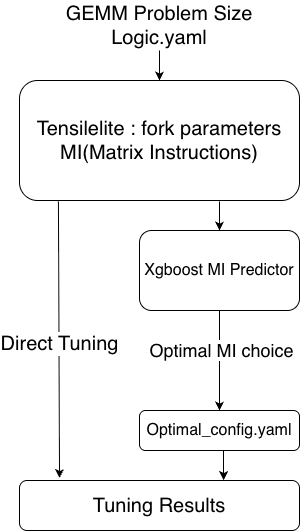

# Tensile MI Configuration Optimizer & Benchmarking Tool

An end-to-end toolkit for optimizing Tensile Matrix Instruction (MI) configurations using XGBoost. This tool predicts GFLOPS performance to select the best configurations, runs benchmarks, and analyzes the speedup achieved compared to baseline.


## Features

- **ML-Based Optimization**: Uses XGBoost to predict and select top-K MI configurations.
- **Per-Problem Generation**: Creates optimized YAML files for each problem size independently.
- **Automated Benchmarking**: Runs Tensile benchmarks for generated configurations.
- **Speedup Analysis**: Calculates time savings and speedup ratios vs. baseline.
- **Format Preservation**: Maintains original YAML structure and comments.

## Prerequisites

```bash
# Install required Python packages
pip install ruamel.yaml xgboost pandas numpy
```

## Quick Start Guide

### 1. Optimization (Generate Configs)

Generate optimized YAML files containing only the top-20 predicted configurations.

```bash
chmod +x run_optimize_config_yaml_gen.sh
./run_optimize_config_yaml_gen.sh
```
*Output: `./optimal_configs/*.yaml`*

### 2. Benchmarking (Measure Performance)

Run Tensile benchmarks on the optimized configurations.

```bash
chmod +x run_optimal_benchmark.sh
./run_optimal_benchmark.sh \
    ./optimal_configs \
    /workspace/rocm-libraries/projects/hipblaslt/tensilelite/mi_tune \
    ./benchmark_results \
    0
```
*Output: `./benchmark_results/timing_summary.txt`*

### 3. Analysis (Calculate Speedup)

Compare the optimized results against a baseline (optional).

```bash
python3 analyze_speedup.py \
    --baseline ./baseline_results/timing_summary.txt \
    --optimized ./benchmark_results/timing_summary.txt
```

---

## Detailed Usage

### 1. Configuration Optimizer (`predict_mi_and_config_gen.py`)

Predicts performance and generates reduced YAML files.

**Arguments:**

| Argument | Default | Description |
|----------|---------|-------------|
| `--model` | `../model/G3_1500round.xgb` | Path to XGBoost model |
| `--yaml` | `./speedup_test_logic.yaml` | Input YAML configuration |
| `--output-dir` | `./optimal_configs` | Output directory for optimized YAMLs |
| `--top-k` | `20` | Number of top MI configurations to keep |

**Example:**
```bash
python3 predict_mi_and_config_gen.py --top-k 15 --output-dir ./optimal_top15
```

### 2. Benchmark Runner (`run_optimal_benchmark.sh`)

Executes Tensile tuning for all YAML files in a directory and logs execution time.

**Syntax:**
```bash
./run_optimal_benchmark.sh <optimal_dir> <build_dir> <result_dir> <gpu_id>
```

**Example:**
```bash
# Run on GPU 1
./run_optimal_benchmark.sh ./optimal_configs /path/to/tensile/build ./results_gpu1 1
```

### 3. Speedup Analyzer (`analyze_speedup.py`)

Parses timing summaries to calculate efficiency gains.

**Example Output:**
```text
Baseline Configuration:
  Total execution time : 5420s
  Average per YAML     : 1807s

Optimized Configuration:
  Total execution time : 801s
  Average per YAML     : 267s

Speedup Results:
  Speedup ratio        : 6.77x
  Time saved           : 4619s (77.0 min)
  Time reduction       : 85.2%
```

---

## Workflow & File Structure

### Input YAML Format
The tool expects a standard Tensile tuning YAML containing a list of `MatrixInstruction` and `ProblemSizes`.

### Output Directory Structure

```
.
├── optimal_configs/                    # Generated by run_optimize.sh
│   ├── optimal_m576_n576_b1_k4096_top20.yaml
│   └── ...
├── benchmark_results/                  # Generated by run_optimal_benchmark.sh
│   ├── logs/
│   │   └── optimal_m576_n576_b1_k4096_top20.log
│   ├── optimal_m576_n576_b1_k4096_top20/
│   └── timing_summary.txt              # Key file for analysis
└── optimization_summary_top20.txt      # Report from optimization step
```

## Troubleshooting

### Model File Not Found
```
Error: Model file not found: ...
```
**Fix**: Ensure the path to `G3_1500round.xgb` is correct in `run_optimize.sh`.

### Tensile Binary Not Found
```
Error: Tensile binary not found at ...
```
**Fix**: Update the `BUILD_DIR` variable in `run_optimal_benchmark.sh` to point to your `tensilelite/mi_tune` directory.

### Permission Denied
**Fix**: Run `chmod +x *.sh` to make scripts executable.

## Advanced Usage: Parallel Benchmarking

To speed up benchmarking by utilizing multiple GPUs:

```bash
#!/bin/bash
# Run on GPUs 0, 1, 2, 3 simultaneously
for gpu in 0 1 2 3; do
    (
        ./run_optimal_benchmark.sh \
            ./optimal_configs \
            /path/to/tensile/build \
            ./results_gpu${gpu} \
            ${gpu}
    ) &
done
wait
echo "All benchmarks completed."
```

## Files

- `predict_mi_and_config_gen.py`: Core optimization logic.
- `run_optimize_config_yaml_gen.sh`: Wrapper script for optimization.
- `run_optimal_benchmark.sh`: Script to run Tensile and measure time.
- `analyze_speedup.py`: Script to compare baseline vs. optimized timing.
- `speedup_test_logic.yaml`: Example input configuration.
